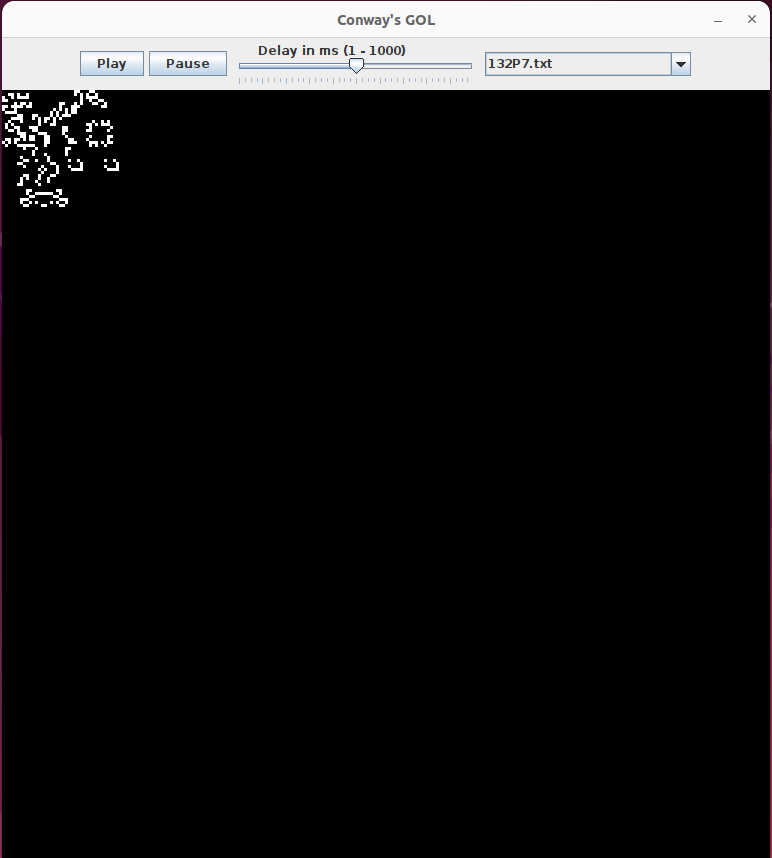

# Game of Life Simulator (Java)

A Java implementation of Conway's **Game of Life** with a graphical interface, configurable neighbourhoods, and an implementation of the **Hashlife** algorithm for simulating very large grids efficiently.

Built as a second-year Computer Science project (Software Design course) at the University of Caen.



## Features

- **Cellular automaton engine**: a 2D grid of live/dead cells evolving generation by generation
- **Hashlife algorithm**: quadtree representation with memoisation (hash table) so that identical regions are computed only once
- **Graphical interface** (Swing-style MVC architecture):
  - Play / Pause controls
  - Speed slider to accelerate or slow down generations
  - Draw your own patterns by clicking on the grid
  - Drop-down menu to load predefined patterns from `.txt` files
- **Selectable neighbourhood**:
  - Moore neighbourhood (default): the 8 surrounding cells
  - Von Neumann neighbourhood: the 4 orthogonal cells, i.e. `(x+1,y)`, `(x-1,y)`, `(x,y+1)`, `(x,y-1)`
- **Pattern loader**: a simple parser that reads a `.txt` file and converts it into a grid

## The Rules

At each step, every cell updates according to its live neighbours:

1. A **dead** cell with exactly **3** live neighbours becomes alive
2. A **live** cell with **2 or 3** live neighbours stays alive
3. In every other case, the cell dies (or stays dead)

The game is a "zero-player game": once the initial configuration is set, it evolves on its own.

## Project Structure

```
.
├── build/       # Compiled files
├── src/         # Source code
│   ├── gameoflife/   # Cellular automaton, quadtree nodes, Hashlife
│   ├── listeners/    # Event listeners (controller part of MVC)
│   ├── views/        # GUI: grid, play/pause buttons, speed slider
│   └── Demo.java     # Entry point
└── patterns/    # Predefined patterns as .txt files
```

The project follows the **Model-View-Controller (MVC)** pattern:

| Package      | Role                                                                     |
|--------------|--------------------------------------------------------------------------|
| `gameoflife` | Model: the automaton, quadtree structure and Hashlife algorithm          |
| `views`      | View: grid display, buttons and slider                                   |
| `listeners`  | Controller: listeners connecting user actions to the model               |

## How It Works

The project was developed in three stages:

1. **Matrix version**: a straightforward grid where each cell's next state is computed from its neighbours. Simple, but it does not scale to large grids.
2. **Quadtree version**: the grid is stored as a quadtree, which handles larger grids more naturally but does not reduce the amount of computation on its own.
3. **Hashlife**: each quadtree node is stored in a hash table. When a node has already been seen, its previously computed result is reused instead of being recalculated. This is especially effective on large, mostly empty grids, where empty regions are recognised and never recomputed.

### Hashing and equality of nodes

`hashCode()` and `equals()` are overridden for quadtree nodes so they can be used as keys in the hash table:

- **Level-1 nodes** (4 cells) are hashed from a string encoding of their four cells
- **Higher-level nodes** are hashed from the hash codes of their four children (`nw`, `ne`, `sw`, `se`)
- Two nodes are considered equal if they have the same hash code and the same level

## Getting Started

Compile and run from the project root (the entry point is `Demo`).

**Linux / macOS**

```bash
javac -d build src/views/*.java src/gameoflife/*.java src/Demo.java src/listeners/*.java; java -cp build Demo
```

**Windows**

```bash
javac -d build src/views/*.java src/gameoflife/*.java src/Demo.java src/listeners/*.java && java -cp build Demo
```

Predefined patterns live in the `patterns/` folder and can be selected from the drop-down menu in the interface. You can also add your own `.txt` pattern files there.

## Authors

- **Quentin Levallois**: Hashlife and quadtree implementation (pair work), project report and presentation
- **Felix Bostock**: Hashlife and quadtree implementation (pair work), graphical interface

## Tech Stack

- Java
- MVC architecture
- Quadtrees and hash-based memoisation (Hashlife)